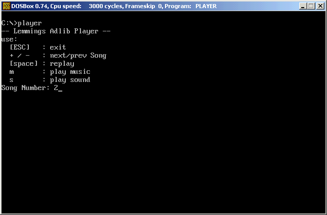

# Lemmings Music Player
DOS Player to use the Lemmings "AdLib.dat" to playback Music &amp; Sounds of the original Game

The Lemmings Music is stored in the "AdLib.dat". After decompressing (http://www.camanis.net/lemmings/tools.php) 
 the .dat file you get a DOS-COM-File (lib/driver).

This simple program "player.exe" adds an .EXE header before the .COM Program and runs the AdLib-lib by calling interupts 
 (Int 61h like the original Lemmings game did)

- To compile the "player.asm" you need e.g. the "flat assembler" (http://flatassembler.net/)
- To run this you need an DOS environment like DOS-Box (http://www.dosbox.com/)

Regards Thomas

